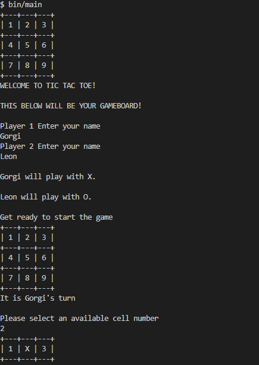

# Tic Tac Toe

> Ruby's Tic Tac Toe is a classic 3x3 game built with ruby and the usage of object oriented programming,

## Built With

- Ruby

## Getting Started

- **Clone the repo by running `git clone` https://github.com/Solenka1/tic.tac.toe Or download the zip folder**
- **Run `cd` tic_tac_toe in the terminal**
- **Make sure you have ruby installed locally run `ruby -v`**
- **To start the game run `bin/main` in the terminal**

### Game Instructions

1. The game is played on a 3xs display grid
2. Player one is assigned 'X' while player two is assigned 'O'.
3. Players take turns putting their markers in the place of numbers in the grid
4. The first player to get 3 of the same markers in a row (up, down, across, or diagonally) is the winner.
5. When all 9 positions are replaced with the markers, the game is over. If no player has 3 marks in a row, the game ends in a draw

## Authors

👤 **Gorgi Mitev**

- GitHub: [@Solenka1](https://github.com/Solenka1)
- Twitter: [@GorgiMitev](https://twitter.com/GorgiMitev)
- LinkedIn: [gorgi-mitev](https://www.linkedin.com/in/gorgi-mitev-a350311b8/)

👤 **Leon Mbegera**

- GitHub: [@githubhandle](https://github.com/Leon-Mbegera)
- LinkedIn: [LinkedIn](https://www.linkedin.com/in/leon-mbegera-053991174/)

## 🤝 Contributing

Contributions, issues, and feature requests are welcome!

Feel free to check the [issues page](issues/).

## Show your support

Give a ⭐️ if you like this project!

## Acknowledgments

- Microverse
- The Odin Project

## 📝 License

This project is [MIT](./LICENSE) licensed.
